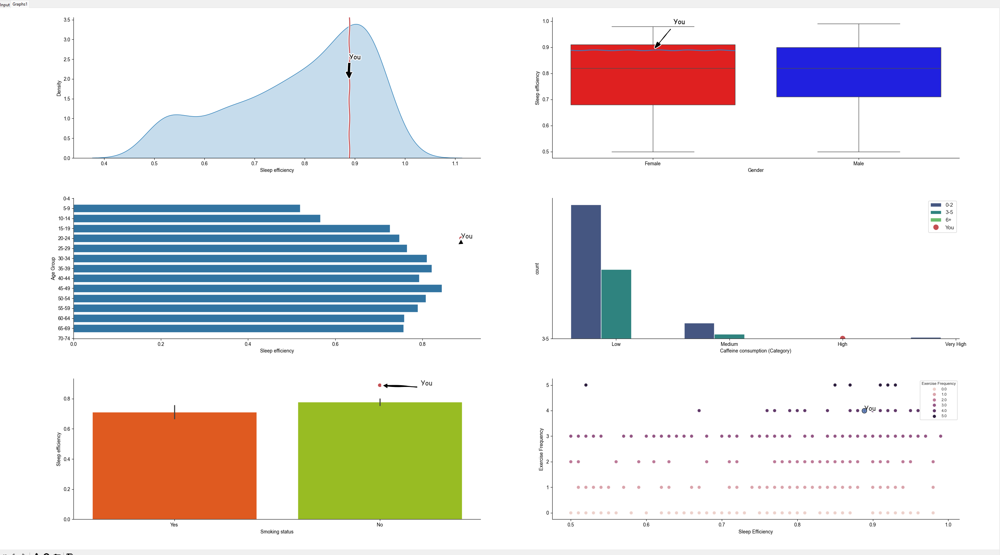

# Sleep Efficiency Analyzer

A Python desktop application that helps you analyze your sleep habits. It compares your lifestyle data to a larger dataset and visualizes how you stack up in 6 different categories.

## 🎯 Features

* Enter your personal data: age, sex, sleep hours, smoking status, exercise, and more.
* Generates 6 unique graphs showing:
    * Sleep Efficiency Distribution
    * Sleep Efficiency by Gender
    * Sleep Efficiency by Age Group
    * Caffeine's Influence on Awakenings
    * Smoking's Influence on Sleep Efficiency
    * Exercise's Influence on Sleep Efficiency
* Built UI using `customtkinter`.

## 🛠️ Tech Stack

* Python
* CustomTkinter (for the UI)
* Pandas (for data manipulation)
* Matplotlib & Seaborn (for data visualization)
* Pygame (for playing music)

## 🚀 How to Run

1.  Clone the repository:
    ```bash
    git clone [https://github.com/natalia0sperczynska/LocateYourself.git](https://github.com/natalia0sperczynska/LocateYourself.git)
    ```
2.  Install the required packages:
    ```bash
    pip install -r requirements.txt
    ```
3.  Run the application:
    ```bash
    python Main/UI.py
    ```
## 📈Example Output





## 💤Enjoy!
